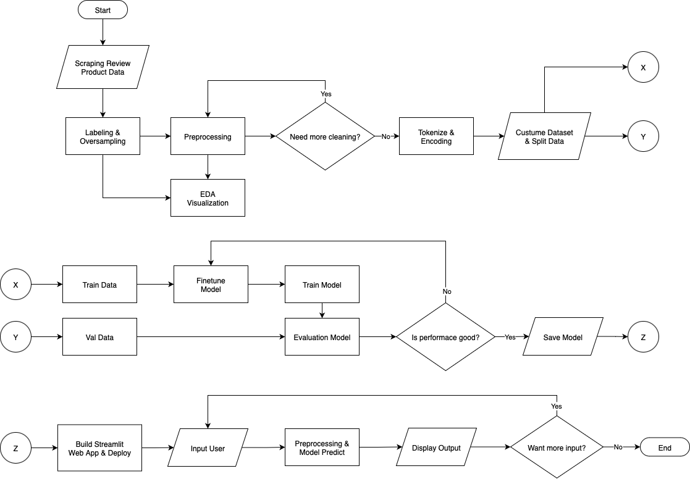

# 💬 Tokopedia Product Review Sentiment Classifier

---

## Project Overview

**Tokopedia Product Review Sentiment Classifier** adalah proyek klasifikasi sentimen untuk ulasan produk berbahasa Indonesia di platform Tokopedia. Tujuannya adalah memprediksi sentimen ulasan ke dalam tiga kelas yaitu positif, netral, dan negatif.

Proyek ini menggunakan model **IndoBERT** dari Hugging Face (`indobenchmark/indobert-base-p1`) yang difine-tune dengan `BertForSequenceClassification` untuk menghasilkan prediksi sentimen. Hasil akhir diharapkan dapat membantu memahami persepsi pelanggan terhadap produk di Tokopedia secara lebih sistematis, dengan alasan pemilihan model karena IndoBERT memang dilatih khusus untuk bahasa Indonesia dan mudah diadaptasi untuk klasifikasi sentimen tiga kelas.

---

## Dataset & Labelling

Dataset diperoleh melalui web scraping Tokopedia dalam dua tahap:

1. `product_scraper.py` – mengambil daftar produk berdasarkan keyword dan menyimpan ke `tokopedia_products.csv`.
2. `review_scraper.py` – mengumpulkan ulasan dari produk tersebut (berisi rating, timestamp, dan teks review), disimpan ke `tokopedia_reviews.csv`.

Label sentimen ditentukan secara otomatis menggunakan model pretrained `w11wo/indonesian-roberta-base-sentiment-classifier` dari Hugging Face dengan tiga kelas: positif, netral, negatif. Setelah labeling, dilakukan proses oversampling untuk menyeimbangkan distribusi kelas.

Sebelum masuk ke pelatihan, teks review melalui tahap preprocessing:
- Konversi huruf ke lowercase
- Menghapus angka, tanda baca, dan emoji
- Menghapus kata dengan panjang 1 karakter
- Normalisasi kata gaul menggunakan kamus sederhana (contoh: gk → nggak, bgt → banget, tp → tapi)

Dataset hasil preprocessing ini kemudian digunakan untuk fine-tuning model IndoBERT.

---

## Setup Instructions

Ikuti langkah-langkah berikut untuk menyiapkan dan menjalankan proyek:

1. Clone Repository

```
git clone https://github.com/alandhar/nolimit-ds-test-Muhamad-Alan-Dharma.git
cd nolimit-ds-test-Muhamad-Alan-Dharma
```

2. Buat Virtual Environment

```
python -m venv venv
source venv/bin/activate   # Linux/Mac
venv\Scripts\activate      # Windows
```

3. Install Dependencies

```
pip install -r requirements.txt
```

4. Scraping Data

```
python main_scraper.py
```

5. Training & Evaluation

```
jupyter notebook model.ipynb
```
6. Demo Aplikasi

```
streamlit run app.py
```

Atau langsung akses melalui link [demo](#demo) yang telah disediakan.

---

## Modeling (IndoBERT Fine-tuning)

- **Model**: [`indobenchmark/indobert-base-p1`](https://huggingface.co/indobenchmark/indobert-base-p1)  
- **Framework**: Hugging Face Transformers + PyTorch  
- **Teknik yang digunakan**:  
  - Oversampling untuk mengatasi ketidakseimbangan kelas  
  - Tokenisasi & encoding teks menggunakan tokenizer IndoBERT  
  - Fine-tuning model dengan `Trainer API`  
- **Hasil Evaluasi**:  
  - **Akurasi**: > 93%  
  - **F1-score**: > 93%  

IndoBERT dipilih karena:  

1. Sudah dilatih secara khusus pada korpus Bahasa Indonesia, sehingga lebih baik dalam menangkap konteks linguistik lokal dibanding model multilingual.  
2. Mendukung fine-tuning untuk klasifikasi teks dengan integrasi langsung di Hugging Face.  
3. Memiliki ukuran model yang relatif seimbang antara kinerja dan kecepatan inference, cocok untuk eksperimen sekaligus demo aplikasi.  
4. Karena data dikumpulkan melalui web scraping ulasan produk berbahasa Indonesia (Tokopedia), penggunaan model khusus Bahasa Indonesia menjadi pilihan yang lebih relevan dan tepat.  

---

## Flowchart



Berikut adalah alur kerja proyek **Tokopedia Product Review Sentiment Classifier**:

1. **Scraping Data Review**  
   - Mengambil data ulasan produk Tokopedia menggunakan `main_scraper.py`.

2. **Labeling & Oversampling**  
   - Memberi label sentimen (positif, netral, negatif) menggunakan model pretrained.  
   - Menyeimbangkan distribusi kelas dengan oversampling.

3. **Preprocessing & EDA**  
   - Membersihkan teks (lowercase, hapus angka/punctuation/emoji, normalisasi kata gaul).  
   - Melakukan eksplorasi data (EDA) untuk memahami distribusi dan pola.

4. **Tokenisasi & Encoding**  
   - Mengubah teks menjadi token menggunakan tokenizer IndoBERT.  
   - Membagi data menjadi **train set** dan **validation set**.

5. **Training & Fine-tuning Model**  
   - Melatih model IndoBERT menggunakan data latih.  
   - Fine-tuning untuk meningkatkan performa.  
   - Mengevaluasi hasil dengan metrik (Accuracy, F1-score).

6. **Evaluasi Model**  
   - Jika performa belum baik → ulangi tahap fine-tuning/training.  
   - Jika performa sudah baik → simpan model.

7. **Deployment (Streamlit App)**  
   - Model disajikan dalam aplikasi web berbasis Streamlit.  
   - User dapat memasukkan teks review → sistem melakukan preprocessing → prediksi sentimen → menampilkan output.  
   - User bisa mengulangi input atau mengakhiri sesi.

---

## Demo

Klik tombol di bawah untuk mencoba aplikasi Streamlit secara langsung:  

[](https://nolimit-ds-test-muhamad-alan-dharma-pgqiey3r4ndkj3ylxrgiyu.streamlit.app/)